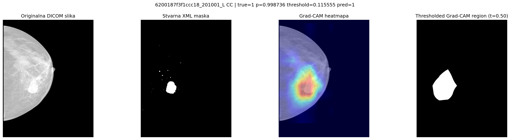
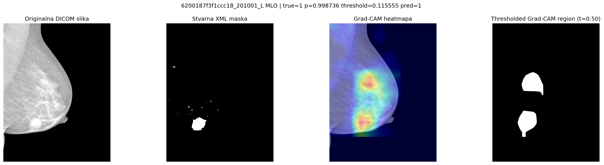
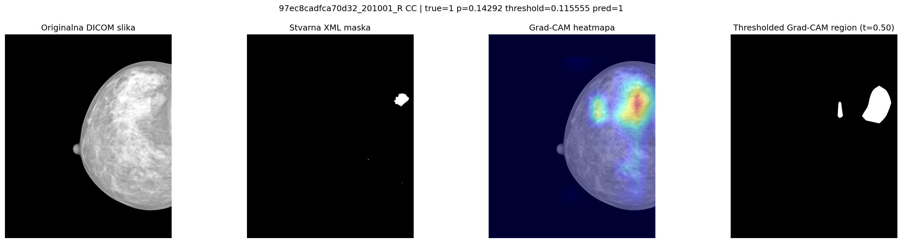
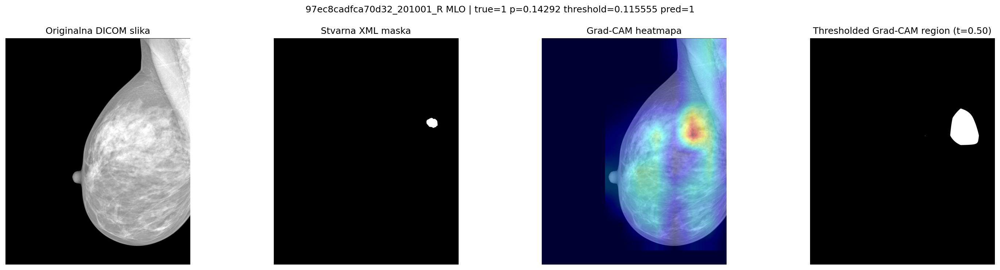

# Klasifikacija mamografskih snimaka pomoću Swin-Tiny modela

## Cilj projekta

Cilj projekta je binarna klasifikacija mamografskih pregleda na nivou dojke. Jedan ulazni primer čine upareni CC i MLO snimci iste dojke, a model vraća verovatnoću i predikciju klase. Korišćen je Swin-Tiny model sa zajedničkim enkoderom za oba prikaza.

Klase su definisane na osnovu BI-RADS kategorije:

- BI-RADS 1–3: negativna klasa
- BI-RADS 4–6: pozitivna klasa

Ove oznake predstavljaju radiološku procenu, a ne histološki potvrđenu dijagnozu maligniteta.

## Podaci

Korišćen je javni INbreast skup digitalnih mamografskih snimaka. Nakon pripreme podataka formirana su 202 kompletna para CC/MLO snimaka od 107 pacijenata:

- 152 negativna i 50 pozitivnih primera
- 104 para leve i 98 parova desne dojke
- 169 parova sa dostupnom ROI anotacijom lezije

Podela podataka obavljena je na nivou pacijenta kako se snimci istog pacijenta ne bi pojavili i u trening i u test skupu.

## Pokretanje projekta

Projekat zahteva Python 3.12 ili 3.13. Virtuelno okruženje i zavisnosti na Windowsu mogu se pripremiti sledećim komandama:

```powershell
py -3.13 -m venv .venv
.\.venv\Scripts\Activate.ps1
python -m pip install --upgrade pip
python -m pip install -r requirements.txt
```

INbreast skup nije uključen u repozitorijum. Podrazumevana struktura podataka je:

```text
data/INbreast Release 1.0/
├── INbreast.xls
├── AllDICOMs/
└── AllXML/
```

Ako se skup nalazi na drugoj lokaciji, putanja se može zadati argumentom `--data-root`.

Priprema metapodataka:

```powershell
python train.py --config config.yaml --mode prepare
```

Provera pripremljenih podataka i pipeline-a:

```powershell
python train.py --config config.yaml --mode sanity
```

Finalni 5-fold Swin-Tiny eksperiment, uključujući evaluaciju i Grad-CAM analizu, pokreće se komandom:

```powershell
python train.py --config final_experiment.yaml --device auto
```

Opcija `--device auto` automatski bira dostupan CUDA, MPS ili CPU uređaj i zamenjuje uređaj naveden u konfiguracionom fajlu. Generisani modeli, metrike i Grad-CAM slike čuvaju se u direktorijumu `artifacts/final_baseline/`.

## Grad-CAM analiza

Grad-CAM je primenjen na finalni Swin-Tiny model radi vizuelnog objašnjenja delova CC i MLO snimaka koji su najviše uticali na pozitivnu predikciju. Aktivacione mape vraćene su u prostor originalnog mamograma i upoređene sa dostupnim XML ROI anotacijama.

Grad-CAM služi za interpretaciju klasifikacionog modela i ne predstavlja segmentaciju lezije niti dokaz da je model naučio klinički ispravne karakteristike.

## Konačni rezultat

Finalni Swin-Tiny model evaluiran je primenom spoljašnje 5-fold unakrsne validacije. Za konačnu klasifikaciju korišćen je `youden_j` prag.

| Metrika | Rezultat |
| --- | ---: |
| Senzitivnost | 0.6600 |
| Specifičnost | 0.8092 |
| Balanced accuracy | 0.7346 |
| F1 | 0.5893 |
| ROC-AUC | 0.7668 |
| PR-AUC | 0.6120 |

### Grad-CAM primeri

Prikazani su anonimizovani true-positive primeri za CC i MLO projekcije. Svaka slika sadrži originalni mamogram, referentnu XML masku, Grad-CAM mapu i njihov preklop.

### Primer 1

| CC projekcija | MLO projekcija |
| --- | --- |
|  |  |

### Primer 2

| CC projekcija | MLO projekcija |
| --- | --- |
|  |  |

Rezultati nisu namenjeni kliničkoj upotrebi.
